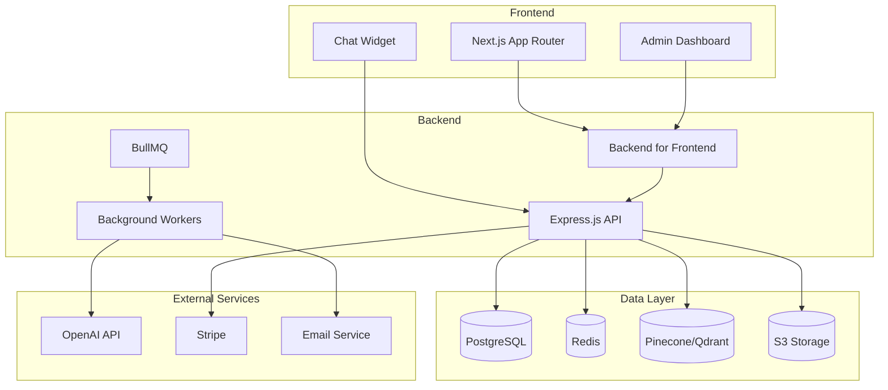
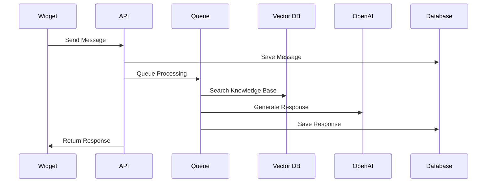
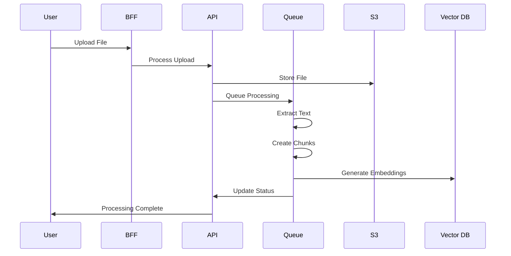

# AI Chat Application Architecture

## 概要

AI Chatアプリケーションは、企業がウェブサイトにAIチャットボットを簡単に統合できるSaaSプラットフォームです。

## システム構成



## アーキテクチャ原則

### 1. 関心の分離

- **フロントエンド**: ユーザーインターフェースとユーザー体験
- **BFF**: フロントエンド専用API、データ変換、認証
- **API**: ビジネスロジック、データ処理、外部サービス統合
- **データレイヤー**: データ永続化、キャッシュ、検索

### 2. スケーラビリティ

- 水平スケーリング対応
- 非同期処理による負荷分散
- CDN活用によるグローバル配信
- データベースパフォーマンス最適化

### 3. セキュリティ

- JWT認証
- RBAC（役割ベースアクセス制御）
- HTTPS通信
- データ暗号化
- レート制限

### 4. 保守性

- TypeScript使用による型安全性
- モジュラーアーキテクチャ
- 自動テスト
- CI/CD パイプライン

## 技術スタック

### フロントエンド

- **Framework**: Next.js 14 with App Router
- **Language**: TypeScript
- **Styling**: Tailwind CSS
- **UI Library**: Radix UI
- **State Management**: React Query (TanStack Query)
- **Forms**: React Hook Form + Zod

### バックエンド

- **API Framework**: Express.js
- **Language**: TypeScript
- **Database**: PostgreSQL + Prisma ORM
- **Cache**: Redis
- **Queue**: BullMQ
- **Vector Database**: Pinecone
- **File Storage**: AWS S3

### インフラストラクチャ

- **Hosting**: Vercel (Frontend), Railway (Backend)
- **Database**: Railway PostgreSQL
- **CDN**: Vercel Edge Network
- **Monitoring**: Sentry + OpenTelemetry
- **CI/CD**: GitHub Actions

## ディレクトリ構造

### Frontend (`ai-chat-ui/`)

```
ai-chat-ui/
├── app/                    # Next.js App Router
│   ├── (auth)/            # 認証関連ページ
│   ├── (marketing)/       # マーケティングページ
│   ├── (org)/             # 組織管理ページ
│   ├── api/bff/           # BFF API routes
│   ├── _components/       # React components
│   │   ├── ui/           # UI primitives
│   │   ├── feature/      # Feature components
│   │   └── layout/       # Layout components
│   ├── _hooks/           # Custom React hooks
│   ├── _schemas/         # Zod validation schemas
│   └── _utils/          # Utility functions
├── public/              # Static assets
└── stories/            # Storybook stories
```

### Backend (`ai-chat/`)

```
ai-chat/
├── src/
│   ├── routes/          # Express routes
│   ├── middleware/      # Express middleware
│   ├── services/        # Business logic
│   ├── jobs/           # Background jobs
│   ├── lib/            # Shared libraries
│   └── utils/          # Utility functions
├── prisma/             # Database schema
└── docs/              # API documentation
```

## データフロー

### 1. チャットメッセージフロー



### 2. ナレッジベース処理フロー



## セキュリティモデル

### 認証・認可

- **JWT Token**: API認証
- **Role-based Access**: 権限管理
- **Organization Isolation**: マルチテナント分離

### データ保護

- **Encryption at Rest**: データベース暗号化
- **Encryption in Transit**: HTTPS/TLS
- **PII Protection**: 個人情報保護

## パフォーマンス最適化

### キャッシュ戦略

- **Redis**: セッション、頻繁なクエリ
- **CDN**: 静的アセット
- **Browser Cache**: クライアントサイドキャッシュ

### データベース最適化

- **Indexing**: クエリ最適化
- **Connection Pooling**: 接続管理
- **Read Replicas**: 読み取り負荷分散

## 監視・ログ

### メトリクス

- **Application Performance**: レスポンス時間、エラー率
- **Infrastructure**: CPU、メモリ、ディスク使用量
- **Business**: チャット数、ユーザー数、満足度

### ログ

- **Structured Logging**: JSON形式
- **Error Tracking**: Sentry
- **Audit Logs**: セキュリティ監査

## デプロイメント

### CI/CD Pipeline

1. **Code Push**: GitHub
2. **Tests**: Unit, Integration, E2E
3. **Build**: TypeScript compilation, bundling
4. **Deploy**: Staging → Production
5. **Monitor**: Health checks, metrics

### 環境管理

- **Development**: ローカル開発環境
- **Staging**: 本番前テスト環境
- **Production**: 本番環境

## 今後の展望

### スケーラビリティ改善

- **Microservices**: サービス分割
- **Event-Driven Architecture**: イベント駆動設計
- **Auto-scaling**: 自動スケーリング

### 機能拡張

- **Multi-language Support**: 多言語対応
- **Advanced Analytics**: 高度な分析機能
- **Third-party Integrations**: 外部サービス連携

### 技術的改善

- **GraphQL**: API改善
- **WebSockets**: リアルタイム通信
- **Edge Computing**: エッジコンピューティング
