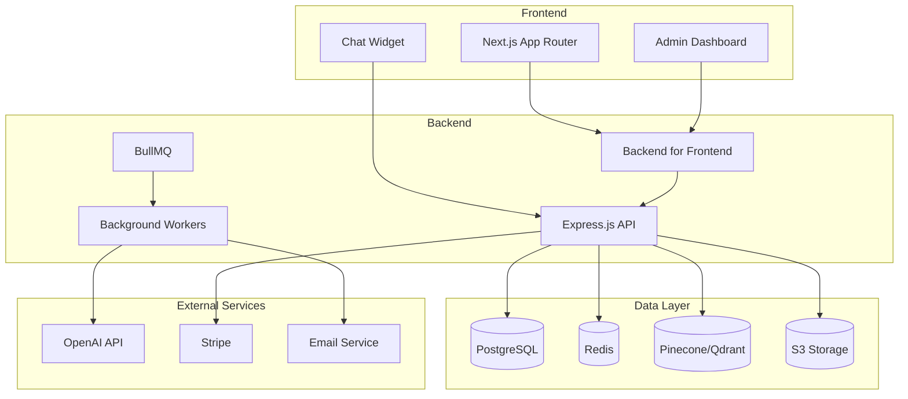
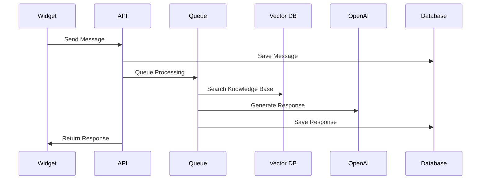
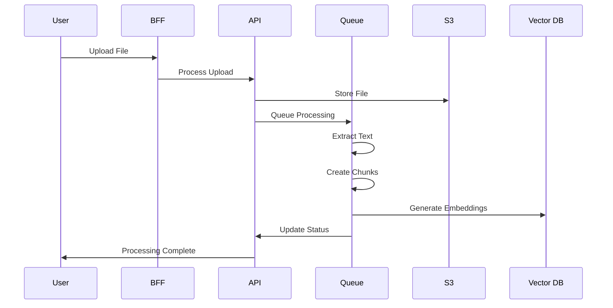

# Section-14: Storybook & アーキテクチャ文書 設計書

**todo-key: `storybook-docs`**

## 概要
Storybookの初期化とコンポーネントカタログの構築、及びアーキテクチャドキュメントの作成を行います。開発チームの効率向上とドキュメント整備を目指します。

## 実装範囲

### 1. Storybook設定 (`ai-chat-ui/.storybook/`)

#### main.js
```javascript
const path = require('path')

module.exports = {
  stories: [
    '../app/_components/**/*.stories.@(js|jsx|ts|tsx|mdx)',
    '../stories/**/*.stories.@(js|jsx|ts|tsx|mdx)'
  ],
  addons: [
    '@storybook/addon-essentials',
    '@storybook/addon-interactions',
    '@storybook/addon-a11y',
    '@storybook/addon-docs',
    '@storybook/addon-controls',
    '@storybook/addon-viewport',
    '@storybook/addon-backgrounds',
    {
      name: '@storybook/addon-styling',
      options: {
        postCss: true
      }
    }
  ],
  framework: {
    name: '@storybook/nextjs',
    options: {}
  },
  features: {
    buildStoriesJson: true
  },
  typescript: {
    check: false,
    reactDocgen: 'react-docgen-typescript',
    reactDocgenTypescriptOptions: {
      shouldExtractLiteralValuesFromEnum: true,
      propFilter: (prop) => (prop.parent ? !/node_modules/.test(prop.parent.fileName) : true),
    },
  },
  webpackFinal: async (config) => {
    // Handle TypeScript path mapping
    config.resolve.alias = {
      ...config.resolve.alias,
      '@': path.resolve(__dirname, '../app'),
    }

    return config
  },
}
```

#### preview.js
```javascript
import '../app/globals.css'
import { themes } from '@storybook/theming'

export const parameters = {
  actions: { argTypesRegex: '^on[A-Z].*' },
  controls: {
    matchers: {
      color: /(background|color)$/i,
      date: /Date$/,
    },
  },
  docs: {
    theme: themes.light,
  },
  backgrounds: {
    default: 'light',
    values: [
      {
        name: 'light',
        value: '#ffffff',
      },
      {
        name: 'dark',
        value: '#1a1a1a',
      },
      {
        name: 'gray',
        value: '#f5f5f5',
      },
    ],
  },
  viewport: {
    viewports: {
      mobile: {
        name: 'Mobile',
        styles: {
          width: '375px',
          height: '667px',
        },
      },
      tablet: {
        name: 'Tablet',
        styles: {
          width: '768px',
          height: '1024px',
        },
      },
      desktop: {
        name: 'Desktop',
        styles: {
          width: '1200px',
          height: '800px',
        },
      },
    },
  },
}

export const globalTypes = {
  theme: {
    name: 'Theme',
    description: 'Global theme for components',
    defaultValue: 'light',
    toolbar: {
      icon: 'paintbrush',
      items: ['light', 'dark'],
      showName: true,
    },
  },
}
```

#### manager.js
```javascript
import { addons } from '@storybook/addons'
import { themes } from '@storybook/theming'

addons.setConfig({
  theme: {
    ...themes.light,
    brandTitle: 'AI Chat UI Components',
    brandUrl: 'https://ai-chat.com',
    brandImage: '/logo.svg',
    colorPrimary: '#007bff',
    colorSecondary: '#6c757d',
  },
})
```

### 2. コンポーネントStories

#### Button Component Story (`app/_components/ui/Button.stories.tsx`)
```typescript
import type { Meta, StoryObj } from '@storybook/react'
import { action } from '@storybook/addon-actions'
import { Button } from './Button'

const meta: Meta<typeof Button> = {
  title: 'UI/Button',
  component: Button,
  parameters: {
    layout: 'centered',
    docs: {
      description: {
        component: 'A versatile button component with multiple variants and sizes.'
      }
    }
  },
  tags: ['autodocs'],
  argTypes: {
    variant: {
      control: { type: 'select' },
      options: ['primary', 'secondary', 'danger', 'ghost'],
      description: 'Visual style variant of the button'
    },
    size: {
      control: { type: 'select' },
      options: ['sm', 'md', 'lg'],
      description: 'Size of the button'
    },
    disabled: {
      control: { type: 'boolean' },
      description: 'Whether the button is disabled'
    },
    loading: {
      control: { type: 'boolean' },
      description: 'Whether the button shows loading state'
    },
    children: {
      control: { type: 'text' },
      description: 'Button content'
    }
  }
}

export default meta
type Story = StoryObj<typeof meta>

export const Primary: Story = {
  args: {
    variant: 'primary',
    children: 'Primary Button',
    onClick: action('clicked')
  }
}

export const Secondary: Story = {
  args: {
    variant: 'secondary',
    children: 'Secondary Button',
    onClick: action('clicked')
  }
}

export const Danger: Story = {
  args: {
    variant: 'danger',
    children: 'Delete',
    onClick: action('clicked')
  }
}

export const Ghost: Story = {
  args: {
    variant: 'ghost',
    children: 'Ghost Button',
    onClick: action('clicked')
  }
}

export const Loading: Story = {
  args: {
    variant: 'primary',
    children: 'Loading...',
    loading: true,
    onClick: action('clicked')
  }
}

export const Disabled: Story = {
  args: {
    variant: 'primary',
    children: 'Disabled Button',
    disabled: true,
    onClick: action('clicked')
  }
}

export const Sizes: Story = {
  render: () => (
    <div className="flex gap-4 items-center">
      <Button size="sm" onClick={action('small clicked')}>Small</Button>
      <Button size="md" onClick={action('medium clicked')}>Medium</Button>
      <Button size="lg" onClick={action('large clicked')}>Large</Button>
    </div>
  ),
  parameters: {
    docs: {
      description: {
        story: 'Different button sizes available'
      }
    }
  }
}
```

#### Chat Component Story (`app/_components/feature/chat/ChatMessage.stories.tsx`)
```typescript
import type { Meta, StoryObj } from '@storybook/react'
import { ChatMessage } from './ChatMessage'

const meta: Meta<typeof ChatMessage> = {
  title: 'Features/Chat/ChatMessage',
  component: ChatMessage,
  parameters: {
    layout: 'padded',
    docs: {
      description: {
        component: 'A chat message component that displays user and bot messages with feedback options.'
      }
    }
  },
  tags: ['autodocs'],
  argTypes: {
    message: {
      description: 'Chat message data object'
    },
    onFeedback: {
      description: 'Callback for feedback actions'
    }
  }
}

export default meta
type Story = StoryObj<typeof meta>

const sampleUserMessage = {
  id: '1',
  question: 'How do I reset my password?',
  answer: '',
  userId: 'user-123',
  createdAt: new Date().toISOString(),
  type: 'user'
}

const sampleBotMessage = {
  id: '2',
  question: 'How do I reset my password?',
  answer: 'To reset your password, go to the login page and click on "Forgot Password". Enter your email address and we\'ll send you instructions to reset your password.',
  userId: 'user-123',
  createdAt: new Date().toISOString(),
  type: 'bot'
}

export const UserMessage: Story = {
  args: {
    message: sampleUserMessage,
    onFeedback: (messageId: string, helpful: boolean) => {
      console.log('Feedback:', messageId, helpful)
    }
  }
}

export const BotMessage: Story = {
  args: {
    message: sampleBotMessage,
    onFeedback: (messageId: string, helpful: boolean) => {
      console.log('Feedback:', messageId, helpful)
    }
  }
}

export const LongBotMessage: Story = {
  args: {
    message: {
      ...sampleBotMessage,
      answer: `To reset your password, please follow these detailed steps:

1. Go to the login page by clicking on the "Sign In" button in the top right corner of our website
2. Click on the "Forgot Password?" link below the password field
3. Enter the email address associated with your account
4. Check your email inbox for a password reset link (it might take a few minutes)
5. Click on the reset link in the email
6. Create a new strong password that includes:
   - At least 8 characters
   - A mix of uppercase and lowercase letters
   - At least one number
   - At least one special character
7. Confirm your new password
8. Log in with your new credentials

If you don't receive the email within 10 minutes, please check your spam folder or contact our support team for assistance.`
    },
    onFeedback: (messageId: string, helpful: boolean) => {
      console.log('Feedback:', messageId, helpful)
    }
  }
}

export const MessageWithCode: Story = {
  args: {
    message: {
      ...sampleBotMessage,
      answer: `You can integrate our widget using this code:

\`\`\`html
<script src="https://widget.ai-chat.com/widget.js"></script>
<script>
  AIChatWidget.init({
    widgetKey: 'your-widget-key',
    theme: 'light'
  })
</script>
\`\`\`

Make sure to replace \`your-widget-key\` with your actual widget key from the dashboard.`
    },
    onFeedback: (messageId: string, helpful: boolean) => {
      console.log('Feedback:', messageId, helpful)
    }
  }
}
```

#### Widget Preview Story (`app/_components/feature/widgets/WidgetPreview.stories.tsx`)
```typescript
import type { Meta, StoryObj } from '@storybook/react'
import { WidgetPreview } from './create/WidgetPreview'

const meta: Meta<typeof WidgetPreview> = {
  title: 'Features/Widgets/WidgetPreview',
  component: WidgetPreview,
  parameters: {
    layout: 'centered',
    docs: {
      description: {
        component: 'A preview component that shows how the chat widget will appear on a website.'
      }
    }
  },
  tags: ['autodocs']
}

export default meta
type Story = StoryObj<typeof meta>

export const Default: Story = {
  args: {
    config: {
      theme: 'light',
      primaryColor: '#007bff',
      secondaryColor: '#6c757d',
      backgroundColor: '#ffffff',
      textColor: '#212529',
      borderRadius: 8,
      fontFamily: 'Inter, sans-serif',
      name: 'Customer Support'
    }
  }
}

export const DarkTheme: Story = {
  args: {
    config: {
      theme: 'dark',
      primaryColor: '#0d6efd',
      secondaryColor: '#6c757d',
      backgroundColor: '#1a1a1a',
      textColor: '#ffffff',
      borderRadius: 12,
      fontFamily: 'Inter, sans-serif',
      name: 'AI Assistant'
    }
  }
}

export const CustomBranding: Story = {
  args: {
    config: {
      theme: 'light',
      primaryColor: '#28a745',
      secondaryColor: '#17a2b8',
      backgroundColor: '#f8f9fa',
      textColor: '#495057',
      borderRadius: 16,
      fontFamily: 'Roboto, sans-serif',
      name: 'Support Bot',
      logoUrl: 'https://via.placeholder.com/32x32'
    }
  }
}

export const MinimalStyle: Story = {
  args: {
    config: {
      theme: 'light',
      primaryColor: '#000000',
      secondaryColor: '#666666',
      backgroundColor: '#ffffff',
      textColor: '#333333',
      borderRadius: 0,
      fontFamily: 'monospace',
      name: 'Minimal Chat'
    }
  }
}
```

### 3. Storybook組織化

#### Introduction Story (`stories/Introduction.stories.mdx`)
```mdx
import { Meta } from '@storybook/addon-docs'

<Meta title="Introduction" />

# AI Chat UI Components

Welcome to the AI Chat UI component library! This Storybook contains all the reusable components used in our chat application.

## Getting Started

This component library is built with:
- **React 18** with TypeScript
- **Next.js 14** with App Router
- **Tailwind CSS** for styling
- **Radix UI** for accessible primitives

## Component Categories

### UI Components
Basic building blocks like buttons, inputs, and modals.

### Feature Components
Complex components specific to chat functionality like message displays, widget configurators, and analytics dashboards.

### Layout Components
Components for page structure and navigation.

## Design System

Our design system follows these principles:

### Colors
- **Primary**: #007bff (Blue)
- **Secondary**: #6c757d (Gray)
- **Success**: #28a745 (Green)
- **Danger**: #dc3545 (Red)
- **Warning**: #ffc107 (Yellow)

### Typography
- **Font Family**: Inter, system-ui, sans-serif
- **Scale**: 12px, 14px, 16px, 18px, 20px, 24px, 32px, 48px

### Spacing
- **Scale**: 4px, 8px, 12px, 16px, 24px, 32px, 48px, 64px

### Border Radius
- **Small**: 4px
- **Medium**: 8px
- **Large**: 12px
- **XLarge**: 16px

## Development Guidelines

### Writing Stories
- Use descriptive names for stories
- Include multiple variants showing different states
- Add proper controls for interactive properties
- Write clear documentation

### Accessibility
- Use semantic HTML elements
- Include proper ARIA labels
- Test with screen readers
- Ensure proper color contrast

### Testing
- Stories serve as visual tests
- Use interaction testing for complex flows
- Test responsive behavior across viewports
```

#### Design Tokens (`stories/design-tokens/Colors.stories.tsx`)
```typescript
import type { Meta, StoryObj } from '@storybook/react'

const meta: Meta = {
  title: 'Design Tokens/Colors',
  parameters: {
    docs: {
      description: {
        component: 'Color palette used throughout the application'
      }
    }
  }
}

export default meta

const ColorSwatch = ({ name, value, description }: { name: string; value: string; description?: string }) => (
  <div className="flex items-center gap-4 p-4 border rounded-lg">
    <div 
      className="w-16 h-16 rounded-lg border shadow-sm" 
      style={{ backgroundColor: value }}
    />
    <div>
      <h3 className="font-semibold text-lg">{name}</h3>
      <p className="text-gray-600 font-mono text-sm">{value}</p>
      {description && <p className="text-gray-500 text-sm mt-1">{description}</p>}
    </div>
  </div>
)

export const Primary: StoryObj = {
  render: () => (
    <div className="grid gap-4">
      <ColorSwatch 
        name="Primary" 
        value="#007bff" 
        description="Main brand color used for primary actions"
      />
      <ColorSwatch 
        name="Primary Hover" 
        value="#0056b3" 
        description="Darker shade for hover states"
      />
      <ColorSwatch 
        name="Primary Light" 
        value="#b3d7ff" 
        description="Light shade for backgrounds"
      />
    </div>
  )
}

export const Semantic: StoryObj = {
  render: () => (
    <div className="grid gap-4">
      <ColorSwatch 
        name="Success" 
        value="#28a745" 
        description="Used for success states and positive actions"
      />
      <ColorSwatch 
        name="Warning" 
        value="#ffc107" 
        description="Used for warning states and cautionary actions"
      />
      <ColorSwatch 
        name="Danger" 
        value="#dc3545" 
        description="Used for error states and destructive actions"
      />
      <ColorSwatch 
        name="Info" 
        value="#17a2b8" 
        description="Used for informational content"
      />
    </div>
  )
}

export const Grayscale: StoryObj = {
  render: () => (
    <div className="grid gap-4">
      <ColorSwatch name="Gray 900" value="#212529" description="Primary text color" />
      <ColorSwatch name="Gray 700" value="#495057" description="Secondary text color" />
      <ColorSwatch name="Gray 500" value="#6c757d" description="Muted text color" />
      <ColorSwatch name="Gray 300" value="#dee2e6" description="Border color" />
      <ColorSwatch name="Gray 100" value="#f8f9fa" description="Background color" />
      <ColorSwatch name="White" value="#ffffff" description="Primary background" />
    </div>
  )
}
```

### 4. アーキテクチャドキュメント

#### システム概要 (`docs/architecture.md`)
```markdown
# AI Chat Application Architecture

## 概要

AI Chatアプリケーションは、企業がウェブサイトにAIチャットボットを簡単に統合できるSaaSプラットフォームです。

## システム構成



## アーキテクチャ原則

### 1. 関心の分離
- **フロントエンド**: ユーザーインターフェースとユーザー体験
- **BFF**: フロントエンド専用API、データ変換、認証
- **API**: ビジネスロジック、データ処理、外部サービス統合
- **データレイヤー**: データ永続化、キャッシュ、検索

### 2. スケーラビリティ
- 水平スケーリング対応
- 非同期処理による負荷分散
- CDN活用によるグローバル配信
- データベースパフォーマンス最適化

### 3. セキュリティ
- JWT認証
- RBAC（役割ベースアクセス制御）
- HTTPS通信
- データ暗号化
- レート制限

### 4. 保守性
- TypeScript使用による型安全性
- モジュラーアーキテクチャ
- 自動テスト
- CI/CD パイプライン

## 技術スタック

### フロントエンド
- **Framework**: Next.js 14 with App Router
- **Language**: TypeScript
- **Styling**: Tailwind CSS
- **UI Library**: Radix UI
- **State Management**: React Query (TanStack Query)
- **Forms**: React Hook Form + Zod

### バックエンド
- **API Framework**: Express.js
- **Language**: TypeScript
- **Database**: PostgreSQL + Prisma ORM
- **Cache**: Redis
- **Queue**: BullMQ
- **Vector Database**: Pinecone
- **File Storage**: AWS S3

### インフラストラクチャ
- **Hosting**: Vercel (Frontend), Railway (Backend)
- **Database**: Railway PostgreSQL
- **CDN**: Vercel Edge Network
- **Monitoring**: Sentry + OpenTelemetry
- **CI/CD**: GitHub Actions

## ディレクトリ構造

### Frontend (`ai-chat-ui/`)
```
ai-chat-ui/
├── app/                    # Next.js App Router
│   ├── (auth)/            # 認証関連ページ
│   ├── (marketing)/       # マーケティングページ
│   ├── (org)/             # 組織管理ページ
│   ├── api/bff/           # BFF API routes
│   ├── _components/       # React components
│   │   ├── ui/           # UI primitives
│   │   ├── feature/      # Feature components
│   │   └── layout/       # Layout components
│   ├── _hooks/           # Custom React hooks
│   ├── _schemas/         # Zod validation schemas
│   └── _utils/          # Utility functions
├── public/              # Static assets
└── stories/            # Storybook stories
```

### Backend (`ai-chat/`)
```
ai-chat/
├── src/
│   ├── routes/          # Express routes
│   ├── middleware/      # Express middleware
│   ├── services/        # Business logic
│   ├── jobs/           # Background jobs
│   ├── lib/            # Shared libraries
│   └── utils/          # Utility functions
├── prisma/             # Database schema
└── docs/              # API documentation
```

## データフロー

### 1. チャットメッセージフロー


### 2. ナレッジベース処理フロー


## セキュリティモデル

### 認証・認可
- **JWT Token**: API認証
- **Role-based Access**: 権限管理
- **Organization Isolation**: マルチテナント分離

### データ保護
- **Encryption at Rest**: データベース暗号化
- **Encryption in Transit**: HTTPS/TLS
- **PII Protection**: 個人情報保護

## パフォーマンス最適化

### キャッシュ戦略
- **Redis**: セッション、頻繁なクエリ
- **CDN**: 静的アセット
- **Browser Cache**: クライアントサイドキャッシュ

### データベース最適化
- **Indexing**: クエリ最適化
- **Connection Pooling**: 接続管理
- **Read Replicas**: 読み取り負荷分散

## 監視・ログ

### メトリクス
- **Application Performance**: レスポンス時間、エラー率
- **Infrastructure**: CPU、メモリ、ディスク使用量
- **Business**: チャット数、ユーザー数、満足度

### ログ
- **Structured Logging**: JSON形式
- **Error Tracking**: Sentry
- **Audit Logs**: セキュリティ監査

## デプロイメント

### CI/CD Pipeline
1. **Code Push**: GitHub
2. **Tests**: Unit, Integration, E2E
3. **Build**: TypeScript compilation, bundling
4. **Deploy**: Staging → Production
5. **Monitor**: Health checks, metrics

### 環境管理
- **Development**: ローカル開発環境
- **Staging**: 本番前テスト環境
- **Production**: 本番環境

## 今後の展望

### スケーラビリティ改善
- **Microservices**: サービス分割
- **Event-Driven Architecture**: イベント駆動設計
- **Auto-scaling**: 自動スケーリング

### 機能拡張
- **Multi-language Support**: 多言語対応
- **Advanced Analytics**: 高度な分析機能
- **Third-party Integrations**: 外部サービス連携

### 技術的改善
- **GraphQL**: API改善
- **WebSockets**: リアルタイム通信
- **Edge Computing**: エッジコンピューティング
```

#### コンポーネント設計ガイド (`docs/component-guidelines.md`)
```markdown
# Component Design Guidelines

## コンポーネント設計原則

### 1. 単一責任の原則
各コンポーネントは一つの責任のみを持つべきです。

```typescript
// ❌ 悪い例: 複数の責任を持つコンポーネント
function UserProfileWithChat() {
  // ユーザープロフィール表示 + チャット機能
}

// ✅ 良い例: 単一責任
function UserProfile() {
  // ユーザープロフィール表示のみ
}

function ChatWidget() {
  // チャット機能のみ
}
```

### 2. 合成可能性
小さなコンポーネントを組み合わせて複雑なUIを構築します。

```typescript
// Button.tsx
export function Button({ children, ...props }) {
  return <button {...props}>{children}</button>
}

// Modal.tsx
export function Modal({ children, isOpen, onClose }) {
  return (
    <Dialog open={isOpen} onOpenChange={onClose}>
      {children}
    </Dialog>
  )
}

// 組み合わせて使用
function DeleteConfirmation() {
  return (
    <Modal isOpen={isOpen} onClose={handleClose}>
      <p>削除してもよろしいですか？</p>
      <Button onClick={handleDelete}>削除</Button>
      <Button onClick={handleClose}>キャンセル</Button>
    </Modal>
  )
}
```

### 3. Props設計

#### TypeScript型定義
```typescript
interface ButtonProps {
  variant?: 'primary' | 'secondary' | 'danger'
  size?: 'sm' | 'md' | 'lg'
  disabled?: boolean
  loading?: boolean
  children: React.ReactNode
  onClick?: (event: React.MouseEvent<HTMLButtonElement>) => void
}
```

#### Default Props
```typescript
const defaultProps: Partial<ButtonProps> = {
  variant: 'primary',
  size: 'md',
  disabled: false,
  loading: false
}
```

### 4. スタイリング規約

#### Tailwind CSS使用
```typescript
const buttonStyles = {
  base: 'inline-flex items-center justify-center rounded-md font-medium transition-colors focus:outline-none focus:ring-2 focus:ring-offset-2',
  variants: {
    primary: 'bg-blue-600 text-white hover:bg-blue-700 focus:ring-blue-500',
    secondary: 'bg-gray-200 text-gray-900 hover:bg-gray-300 focus:ring-gray-500',
    danger: 'bg-red-600 text-white hover:bg-red-700 focus:ring-red-500'
  },
  sizes: {
    sm: 'px-3 py-2 text-sm',
    md: 'px-4 py-2 text-base',
    lg: 'px-6 py-3 text-lg'
  }
}
```

### 5. アクセシビリティ

#### ARIA属性
```typescript
function Button({ children, disabled, ...props }) {
  return (
    <button
      disabled={disabled}
      aria-disabled={disabled}
      {...props}
    >
      {children}
    </button>
  )
}
```

#### キーボードナビゲーション
```typescript
function Modal({ isOpen, onClose, children }) {
  useEffect(() => {
    if (isOpen) {
      document.addEventListener('keydown', handleEscape)
      return () => document.removeEventListener('keydown', handleEscape)
    }
  }, [isOpen])

  const handleEscape = (e: KeyboardEvent) => {
    if (e.key === 'Escape') {
      onClose()
    }
  }

  return (
    <Dialog
      role="dialog"
      aria-modal="true"
      aria-labelledby="modal-title"
    >
      {children}
    </Dialog>
  )
}
```

## ディレクトリ構造

```
app/_components/
├── ui/                 # 基本UIコンポーネント
│   ├── Button/
│   │   ├── Button.tsx
│   │   ├── Button.stories.tsx
│   │   └── index.ts
│   └── Modal/
├── feature/           # 機能固有コンポーネント
│   ├── chat/
│   ├── auth/
│   └── dashboard/
└── layout/           # レイアウトコンポーネント
    ├── Header/
    ├── Sidebar/
    └── Footer/
```

## テスト戦略

### Storybook
- コンポーネントの視覚的テスト
- 各stateの動作確認
- インタラクションテスト

### Unit Tests
- ロジックのテスト
- エッジケースの検証
- プロパティの検証

## パフォーマンス

### React.memo
```typescript
export const ExpensiveComponent = React.memo(function ExpensiveComponent({
  data
}: {
  data: ComplexData
}) {
  // 重い計算処理
  return <div>{processedData}</div>
}, (prevProps, nextProps) => {
  return prevProps.data.id === nextProps.data.id
})
```

### useMemo / useCallback
```typescript
function DataVisualization({ data }: { data: DataPoint[] }) {
  const processedData = useMemo(() => {
    return data.map(point => ({
      ...point,
      calculated: expensiveCalculation(point)
    }))
  }, [data])

  const handleClick = useCallback((id: string) => {
    // クリックハンドラー
  }, [])

  return <Chart data={processedData} onClick={handleClick} />
}
```

## コード品質

### ESLint Rules
- `react-hooks/rules-of-hooks`
- `react-hooks/exhaustive-deps`
- `@typescript-eslint/no-unused-vars`
- `jsx-a11y/accessible-emoji`

### Prettier設定
```json
{
  "semi": false,
  "singleQuote": true,
  "tabWidth": 2,
  "trailingComma": "es5"
}
```
```

### 5. Package.json Scripts追加

#### Storybook Scripts (`ai-chat-ui/package.json`)
```json
{
  "scripts": {
    "storybook": "storybook dev -p 6006",
    "build-storybook": "storybook build",
    "storybook:test": "test-storybook",
    "chromatic": "npx chromatic --project-token=YOUR_PROJECT_TOKEN"
  },
  "devDependencies": {
    "@storybook/addon-essentials": "^7.6.0",
    "@storybook/addon-interactions": "^7.6.0",
    "@storybook/addon-a11y": "^7.6.0",
    "@storybook/addon-docs": "^7.6.0",
    "@storybook/addon-controls": "^7.6.0",
    "@storybook/addon-viewport": "^7.6.0",
    "@storybook/addon-backgrounds": "^7.6.0",
    "@storybook/addon-styling": "^1.3.0",
    "@storybook/nextjs": "^7.6.0",
    "@storybook/react": "^7.6.0",
    "@storybook/test-runner": "^0.16.0",
    "chromatic": "^10.0.0",
    "storybook": "^7.6.0"
  }
}
```

### 6. Visual Regression Testing

#### Chromatic設定 (`.chromatic.yml`)
```yaml
# Chromatic configuration
project: YOUR_PROJECT_ID
buildScriptName: build-storybook
exitOnceUploaded: true
exitZeroOnChanges: true
ignoreLastBuildOnBranch: main
```

#### GitHub Actions Workflow (`.github/workflows/chromatic.yml`)
```yaml
name: Chromatic

on:
  push:
    branches: [main, develop]
  pull_request:
    branches: [main, develop]

jobs:
  chromatic:
    runs-on: ubuntu-latest
    steps:
      - name: Checkout code
        uses: actions/checkout@v3
        with:
          fetch-depth: 0

      - name: Setup Node.js
        uses: actions/setup-node@v3
        with:
          node-version: '18'
          cache: 'npm'
          cache-dependency-path: ai-chat-ui/package-lock.json

      - name: Install dependencies
        run: |
          cd ai-chat-ui
          npm ci

      - name: Run Chromatic
        uses: chromaui/action@v1
        with:
          projectToken: ${{ secrets.CHROMATIC_PROJECT_TOKEN }}
          workingDir: ai-chat-ui
          buildScriptName: build-storybook
```

### 7. Documentation Automation

#### TypeDoc設定 (`ai-chat-ui/typedoc.json`)
```json
{
  "entryPoints": ["./app/_components"],
  "out": "./docs/components",
  "theme": "default",
  "includeVersion": true,
  "excludePrivate": true,
  "excludeProtected": true,
  "excludeExternals": true,
  "readme": "./README.md",
  "name": "AI Chat UI Components",
  "tsconfig": "./tsconfig.json"
}
```

#### Documentation Build Script
```bash
#!/bin/bash
# scripts/build-docs.sh

echo "📚 Building documentation..."

# Build Storybook
echo "Building Storybook..."
cd ai-chat-ui
npm run build-storybook

# Build TypeDoc
echo "Building TypeDoc..."
npx typedoc

# Build architecture docs
echo "Building architecture documentation..."
cd ../docs
npx @mermaid-js/mermaid-cli -i architecture.md -o architecture.html

echo "✅ Documentation build complete!"
```

## 作業ステップ

1. **Storybook初期化**: `.storybook/` 設定ファイル作成
2. **基本Stories作成**: UI コンポーネントのStories
3. **Feature Stories**: 機能コンポーネントのStories
4. **Design Tokens**: カラー・タイポグラフィ・スペーシング
5. **アーキテクチャ文書**: システム設計ドキュメント作成
6. **コンポーネントガイドライン**: 設計指針ドキュメント
7. **Visual Testing**: Chromatic 設定
8. **CI/CD統合**: 自動ビルド・デプロイ
9. **Documentation Site**: ドキュメントサイト構築
10. **Team Onboarding**: チーム向けガイド作成

## 成功指標

- 全UIコンポーネントがStorybookで文書化されている
- Visual regression testingが設定されている
- アーキテクチャドキュメントが完成している
- 開発者がコンポーネントを簡単に見つけ、理解できる
- デザイナーと開発者のコラボレーションが改善される
- 新しいチームメンバーのオンボーディングが効率化される